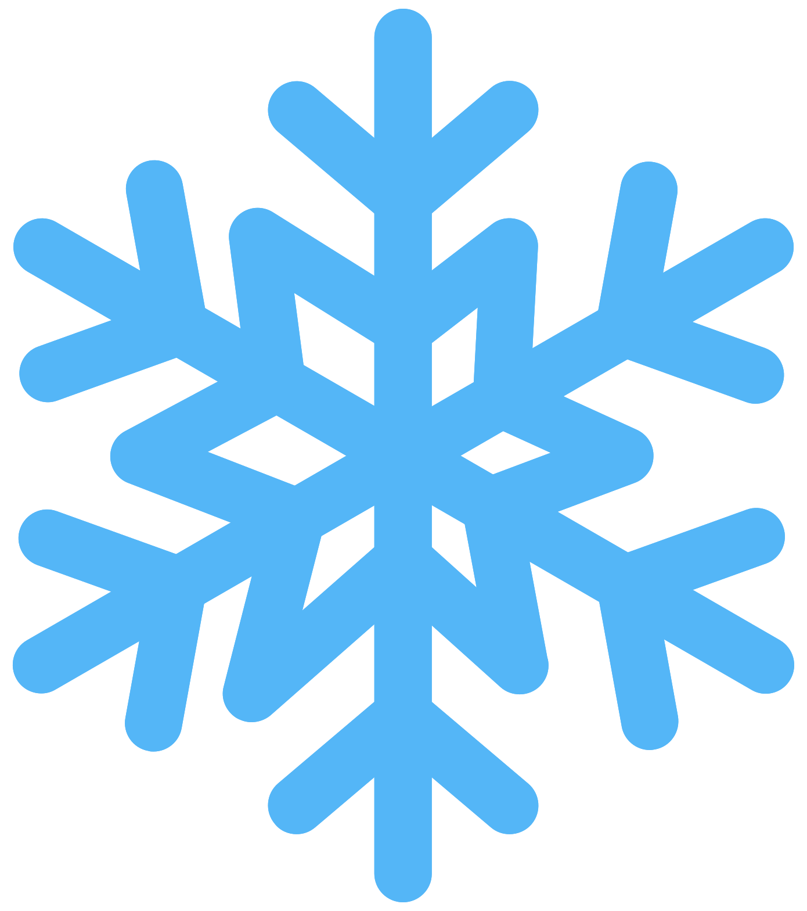
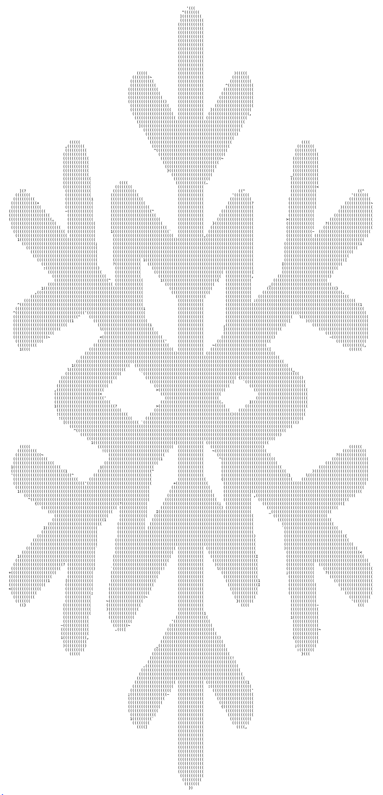

# ASCII Art

The idea of this project is to load images, translate them into ASCII ART images, optionally apply filters, and save them. (https://courses.fit.cvut.cz/BI-OOP/projects/ASCII-art.html)

## Usage

Run the application using `sbt "run <args>"`. Run tests using `sbt test`.

### Importing images

- __`--image <path>`__ to import a image from a file. Currently _PNG_ and _JPEG_ formats are supported.
- __`--image-random`__ to create a random image (random lines in different directions), the size of the image will be between [100; 300] in both width and height.

### ASCII conversion table
A conversion table is used for converting between pixel value and ASCII character.

- __`--table <name>`__ to specify which predefined table to use. Current options are _bourke_ and _grayramp_.
- __`--custom-table <table>`__ to define custom table using a string of characters, with first characters corresponding to darkest pixels and last characters to lightest pixels. (e.g. `--custom-table "@#xw:. "` will map characters in "@#xw:. " to pixels values.)

If no table is specified, the default table is used (_bourke_).

### Exporting images
Images are currently exported in text form.

- __`--output-file <path>`__ to export the image into a text file.
- __`--output-console`__ to print the image into standard output.

Image can be exported multiple times.
### Filters

- __`--brightness <value>`__ to change the brightness of all pixels in a imported image by a given value. Value must be integer and can be positive or negative.
- __`--invert`__ to invert the color of image (black becomes white...).
- __`--flip <axis>`__ to flip the image along a given axis. The axis can be either _x_ or _y_.
- __`--scale <scale>`__ to scale the image by a given scale. This will change the amout of pixels in a image. The scale can be _0.25_, _1_ (identity) and _4_. (e.g. `--scale 0.25` will scale the image to 1/4 of its original size, meaning both dimensions of the image will be halved.)

The filters will be applied in the order they are passed to the application. Multiple filters of the same type can be applied.

## Example
Before: 
 
After: 

<a href="https://www.vecteezy.com/free-png/snowflake">Snowflake PNGs by Vecteezy</a>